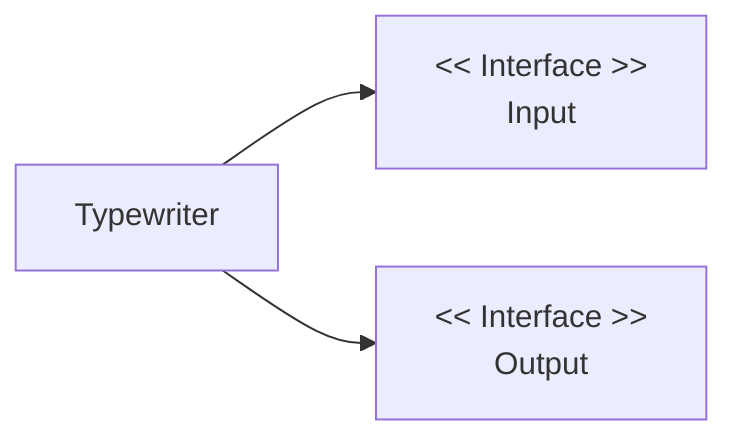
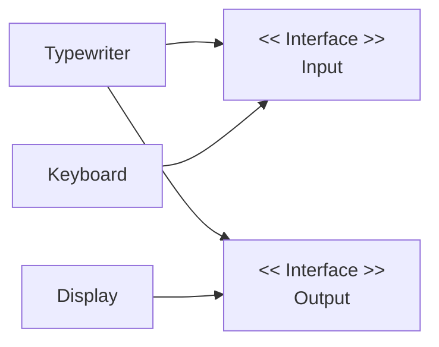

### Capítulo 01 - O que é arquitetura Hexagonal? 
- [Meu complemento🔬📝](#meu-complemento)

O autor apresenta que a `Arquitetura Hexagonal` foi criado com o objetivo de resolver problemas de acoplamento com a **regra de negócio** .
A Arquitetura Hexagonal também é conhecida como `Ports` e `Adapters` (Portas e Adaptadores).

Os `Ports` são divididos em dois grupos:
- `Inbound`  : inputs de entradas.
- `Outbound` : outputs de saídas.

# Adicionar imagem 

### Capítulo 02 - Typewriter - A Máquina de Escrever
Neste capítulo, usaremos um `hello world` como nosso domínio, que será chamado de `Typewriter` (Máquina de Escrever).


### Capítulo 03 - Preparando o Projeto
Estrutura do projeto:
```bash
├── hexagonal
   ├── CMakeLists.txt
   ├── build
   └── src
       ├── adapter
       ├── domain
       └── main.c
```
- `hexagonal`: é a pasta principal do projeto.
- `build`: é a pasta onde todos os arquivos que vão ser gerados pelo
cmake durante o processo de compilação.
- `CMakeLists.txt`: é o arquivo que contém as informações de como o
cmake vai compilar o projeto.
- `src`: é a pasta que contém todo o código fonte da aplicação.
- `adapter`: é a pasta que contém o código fonte relacionado aos
adaptadores.
- `domain`: é a pasta que contém o código fonte relacionado ao
domínio.
- `main.c`: é o arquivo que contém o entrypoint da aplicação.

### Capítulo 04 - Implementando O Domínio
O objetivo é fazer que o Typewriter não dependa de nenhuma tecnologia,evitando assim qualquer tipo de dependência. 

#### Implementando a interface Input
```c
typedef struct 
{
    /* objeto do tipo genérico */
    void *object;

     /* ponteiro para função */
    bool (*get_text)(void *object, char *buffer, size_t size);
}input_base_t;
```
#### Implementando a interface Output
```c
typedef struct 
{
    void *object;
    bool (*set_text)(void *object, char *buffer, size_t size);
}output_base_t;
```
#### Implementando o Typewriter
```c
/* */
typedef struct typewriter_args_t;
/* */
typedef struct typewriter_t;

/* */
bool typewriter_open(typewriter_t *object, typewriter_args_t *args);

/* */
bool typewriter_run(typewriter_t *object);
```

> Nesta função, a aplicação não tem qualquer conhecimento sobre o que está sendo utilizado. Isso permite que troquemos as tecnologias, permitindo que a aplicação seja usada em qualquer cenário.
```c
bool typewriter_run(typewriter_t *object)
```


---

### Capítulo 05 - Implementando o Adaptador Keyboard
Implementamos o primeiro adapter, o `Keyboard` vai implementar a interface `Input`, ou seja, oferecendo as strings para aplicação.

### Capítulo 06 - Implementando o Adaptador Display
Implementamos o segundo adapter, o `Display` vai implementar a interface `Output`, ou seja, vai apresentar as strings em letras minúsculas.

### Capítulo 07 - Juntando as peças do quebra-cabeça
Vamos implementar o arquivo `main.c`.
> typewriter_args_t utilizamos o literal composto. O literal composto é um
recurso do c99, como a variável args é temporária faz sentido utilizar o
recurso.

#### Implementando o script CMakeLists.txt

#### Uma visão atualizada antes de compilar

#### Compilando o projeto
Para compilar é simples, basta entrar na pasta build e executar o comando:
```bash
cmake ..
```
Este comando gera o Makefile para assim compilarmos o projeto. E para compilar execute o comando:
```bash
make
```
Para executar a aplicação execute o comando:
```bash
./bin/hexagonal
```
####  Estrutura final 
```bash
├── hexagonal
    ├── CMakeLists.txt
    ├── build
    │   ├── Makefile
    │   └── bin
    │       └── hexagonal
    └── src
        ├── adapter
        │   ├── display.c
        │   ├── display.h
        │   ├── keyboard.c
        │   └── keyboard.h
        ├── domain
        │   ├── input_base.h
        │   ├── output_base.h
        │   ├── typewriter.c
        │   └── typewriter.h
        └── main.c
```


### Meu complemento🔬📝