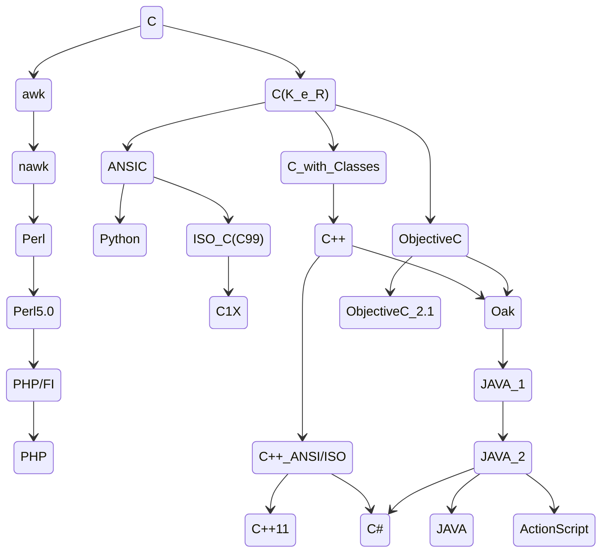
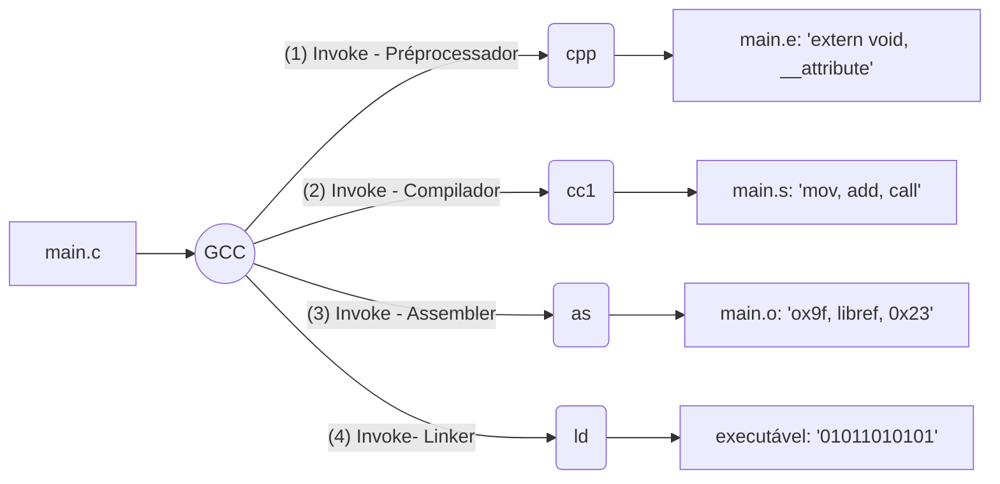

# Capítulo 1: Introdução 
- [1.1. A linguagem C](#11-a-linguagem-c)
- [1.2. Utilizando o Code::Blocks para programar em C](#12-utilizando-o-codeblocks-para-programar-em-c)
- [1.3. Esqueleto de um programa em linguagem C](#13-esqueleto-de-um-programa-em-linguagem-c)
- [1.4. A compilação do programa](#14-a-compilacao-do-programa)
- [1.5. Comentários](#15-comentarios)
- [1.6. Usando uma biblioteca: o comando #include](#16-usando-uma-biblioteca-o-comando-include)
- [1.7. Bibliotecas e funções úteis da linguagem C](#17-biblioteca-e-funcoes-uteis-da-linguagem-c)
- [Meu complemento🔬📝](#meu-complemento)

### Introdução:
- O autor considera a linguagem C com uma das linguagens mais bem-sucedidas de `alto nível` já criada. 
- O livro vai buscar apresentar uma abordagem para programadores e não programadores, para isso ele utiliza o `Code::Blocks`.
- `Code::Blocks`: IDE de código aberto, multiplataforma, múltiplos compiladores.

### 1.1. A linguagem C
Ele comenta que a linguagem foi criada em 1972, nos laboratórios Bell, por Dennis Ritchie, sendo revida e padronizada pelo ANSI em 1989.
Também aborda que a linguagem C fornece acesso a `memória de baixo nível`, o que permite acesso a programação direta do microprocessador. Também permitindo o uso de instruções direto no Assembly, o que pode ser usado para problemas de dependência `critica de tempo`.

#### 1.1.1. Influência da linguagem C



#### Influência da linguagem C  - Sintaxe 

<table style="width: 100%; border-collapse: collapse;">
  <tr>
    <td style="width: 48%; padding: 10px; border: 1px solid #ccc; vertical-align: top;">
      <h2>C</h2>
      <p>Estrutura de controle de repetição.</p>
      <pre><code>
for(i = 1; i <=10; i++) {
  printf("%d\n",i);
}
      </code></pre>
    </td>
    <td style="width: 48%; padding: 10px; border: 1px solid #ccc; vertical-align: top;">
      <h2>Java</h2>
      <p>Estrutura de controle de repetição.</p>
      <pre><code>
for(i = 1; i <=10; i++) {
  System.out.println(i);
}
      </code></pre>
    </td>
  </tr>
  <tr>
    <td style="width: 48%; padding: 10px; border: 1px solid #ccc; vertical-align: top;">
      <h2>PHP</h2>
      <p>Estrutura de controle de repetição.</p>
      <pre><code>
for($i = 1; $i <=10; $i++) {
  echo $i;
}
      </code></pre>
    </td>
    <td style="width: 48%; padding: 10px; border: 1px solid #ccc; vertical-align: top;">
      <h2>Perl</h2>
      <p>Estrutura de controle de repetição.</p>
      <pre><code>
for($i = 1; $i <=10; $i++) {
  print $i;
}
      </code></pre>
    </td>
  </tr>
</table>

### 1.2. Utilizando o Code::Blocks para programar em C
#### 1.2.1. Criando um novo projeto no Code::Blocks
#### 1.2.2 Utilizando o debugger do Code::Blocks
- executar o passo a passo
- Pausa o programa em pontos definidos, breakpoints, examinar o estado atual da variável.
### 1.3. Esqueleto de um programa em linguagem C
#### 1.3.1. Indentação do código
- Torna a leitura do código-fonte mais fácil e facilita a sua modificação.

### 1.4. A compilação do programa

> Pré-processamento    : Remoção de comentários e intepretação das diretivas.

> Verificação sintática: Erros de Sintaxe.

> Compilação           : Criar um arquivo "objeto".

> Link-edição          : Unir todos os arquivos objetos.

### 1.5. Comentários
Serve para escrever alguma coisa, não modificam o comportamento do programa.

`// <palavras>`  : única linha

`/* <texto> */`  : múltiplas linhas

### 1.6. Usando uma biblioteca: o comando #include
`Biblioteca` : conjunto de funções, que contém variáveis, macros, etc., já implementados, e que podem ser utilizados pelo nosso programa.

`.h` : declarações das funções

`.c` : implementação das funções

#### 1.6.1 Criando suas próprias bibliotecas
- Podemos reaproveitar nossas funções, estruturas, etc.
    - \#include <`stdio.h`>

    - \#include "`minhaBiblioteca/soma.h`"

### 1.7. Bibliotecas e funções úteis da linguagem C
1.7.1 Funções de entrada e saída: `stdio.h`
- Operações em arquivos
- Acesso a arquivos
- Entrada/saída formatada
- Entrada/saída de caracteres
- Entrada/saída direta
- Posicionamento no arquivo
- Tratamentos de erros
- Tipos e macros

1.7.2 Funções de utilidades padrão: `stdlib.h`
- Conversão de string
- Geração de sequência pseudoaleatórias
- Gerenciamento de memória dinâmica
- **Ambiente do programa**
- Pesquisa e ordenação
- Aritmética de inteiro

1.7.3 Funções matemáticas: `math.h`
- Funções trigonométricas
- Funções hiperbólicas
- Funções exponenciais e logarítmicas
- Constantes 
- Funções de potência
- Funções de arredondamento, valor absoluto e outras

1.7.4 Testes de tipos de caracteres: `ctype.h`

1.7.5 Operações em string: `string.h`
- Copias
- Conctenação
- Comparação
- Busca
- Outras

1.7.6. Funções de data e hora: `time.h`
- Manipulação do tempo
- Conversão
- Tipos e macros
- Usando a função `strftime()`

---

### Meu complemento🔬📝

**Etapas da compilação do gcc**:

`gcc -E main.c -o main.e`               | Pré-processamento (sintaxe, macro, diretivas).

`gcc -S main.c -o main.s`               | Compilação (assembler).

`gcc -c main.s -o main.o`               | Montagem (objeto).

`gcc  main.o`                         | Ligação (linker objetos).

**Executável**:

`gcc main.o soma.o -o executavel` 

**Utils**

`gcc -H main.c`: Mostra quais arquivos de cabeçalho estão sendo incluídos.

`gcc -dM -E main.c`: Exibe todas as macros definidas.

`gcc -v main.c`: Mostra detalhes do processo completo de compilação, incluindo o pré-processamento.

###  Processo de compilação em C


<table style="width: 100%; border-collapse: collapse;">
  <tr>
    <td style="width: 48%; padding: 10px; border: 1px solid #ccc; vertical-align: top;">
      <h2>main.c</h2>
      <p>Código escrito em C.</p>
      <pre><code>
#include &lt;stdio.h&gt;
#include "soma.h"

/*
.
  No Pré-Processamento 
  MAX será substituindo por "11"
.
*/

#define MAX 11

int main(void){
    printf("Soma: %d\n", soma(10,10));
    printf("MAX: %d\n", MAX);
}
      </code></pre>
    </td>
    <td style="width: 48%; padding: 10px; border: 1px solid #ccc; vertical-align: top;">
      <h2>Pré-Processamento</h2>
      <p>Remoção de comentátios e intepretação das diretivas/macros.</p>
      <pre><code>
\# 959 "/usr/include/stdio.h" 3 4
extern int __uflow (FILE *);
extern int __overflow (FILE *, int);
\# 983 "/usr/include/stdio.h" 3 4

\# 2 "main.c" 2
\# 1 "soma.h" 1

\# 1 "soma.h"
int soma(int a, int b);
\# 3 "main.c" 2
\# 13 "main.c"
int main(void){
    printf("Soma: %d\n", soma(10,10));
    printf("MAX: %d\n", 11);
      </code></pre>
    </td>
  </tr>
  <tr>
    <td style="width: 48%; padding: 10px; border: 1px solid #ccc; vertical-align: top;">
      <h2>Compilação</h2>
      <p>Transforma o código em C para Assembler.</p>
      <pre><code>
	.file	"main.c"
	.text
	.section	.rodata
.LC0:
	.string	"Soma: %d\n"
.LC1:
	.string	"MAX: %d\n"
	.text
	.globl	main
	.type	main, @function
main:
.LFB0:
	.cfi_startproc
	endbr64
	pushq	%rbp
	.cfi_def_cfa_offset 16
	.cfi_offset 6, -16
	movq	%rsp, %rbp
      </code></pre>
    </td>
    <td style="width: 48%; padding: 10px; border: 1px solid #ccc; vertical-align: top;">
      <h2>Objeto</h2>
      <p>Arquivo binário.</p>
      <pre><code>
00000000: 7f45 4c46 0201 0100 0000 0000 0000 0000  .ELF............
00000010: 0300 3e00 0100 0000 6010 0000 0000 0000  ..>.....`.......
00001000: f30f 1efa 4883 ec08 488b 05d9 2f00 0048  ....H...H.../..H
00001010: 85c0 7402 ffd0 4883 c408 c300 0000 0000  ..t...H.........
00001020: ff35 9a2f 0000 ff25 9c2f 0000 0f1f 4000  .5./...%./....@.
00001030: f30f 1efa 6800 0000 00e9 e2ff ffff 6690  ....h.........f.
00001040: f30f 1efa ff25 ae2f 0000 660f 1f44 0000  .....%./..f..D..
00000020: 4000 0000 0000 0000 d036 0000 cafe babe  @........6......
}
      </code></pre>
    </td>
  </tr>
</table>

### Como verificar o nome dos utilitarios usados pelo gcc:
Para ver o nome do pré-processador (cpp):
```cmd
gcc --print-prog-name=cpp
```
Para ver o nome do compilador (cc1):
```cmd
gcc --print-prog-name=cc1
```
Para ver o nome do assembler (as):
```cmd
gcc --print-prog-name=as
```

### Resumo dos principais utilitários do GCC:
- gcc: Compilador de C
- cpp: Pré-processador
- gdb: Depurador (debugger)
- as: Assembler
- ld: Linkador
- ar: Criador de arquivos estáticos
- nm: Exibe informações sobre símbolos em arquivos objeto
- strip: Remove símbolos de depuração de arquivos binários
- objdump: Exibe informações detalhadas de arquivos binários
- objcopy: Copia e modifica arquivos binário

Consultar o manual com o comando info:
> info gcc

Manual de Uso Rápido de GCC
> man gcc

Para o cpp (pré-processador):
> man cpp

Para o as (assembler):
> man as

Para o ld (linkador):
> man ld

Para o gdb (depurador):
> man gdb

Resumo:
- `Documentação online do GCC`: Fonte principal para consultar todas as ferramentas e utilitários do GCC.

- `info gcc`: Para consultar o manual completo no seu sistema local.

- `man`: Para acessar a documentação individual de utilitários como gcc, cpp, as, ld, etc.
